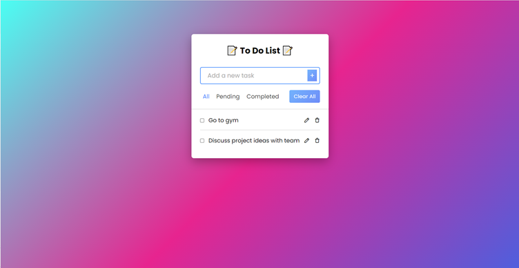
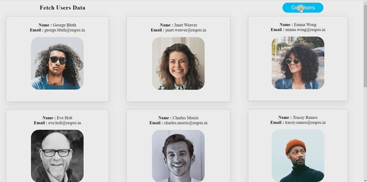
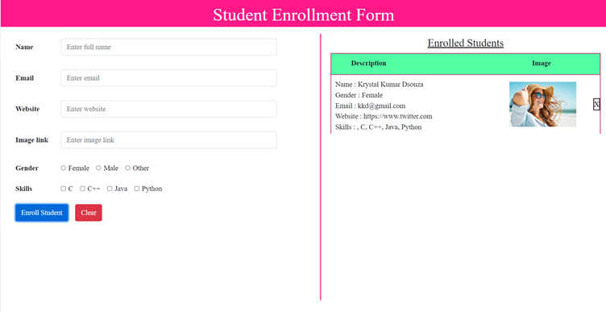
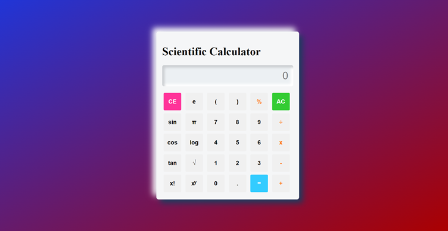

# LetsGrowMore Web Development internship tasks

#### This repository contains tasks of my Web development internship program at LetsGrowMore.

# ❓ What you will find here
- You will find different directories containing different tasks
- Each directory contains separate files related to particular tasks

# 📝 Tasks
### Task 1 : Create a To do list web app  

### Task 2 : Create a web application using create-react-app  

### Task 3 : Create a registration form whose data display in same page  

### Task 4 : Create a calculator  

# 📝 Licensed by 

# 👸🏻 Created by 
Created with 🤍 by (◔◡◔) <a href="https://github.com/CODING-Enthusiast9857" target="_blank">Madhavi Sonawane.</a>
